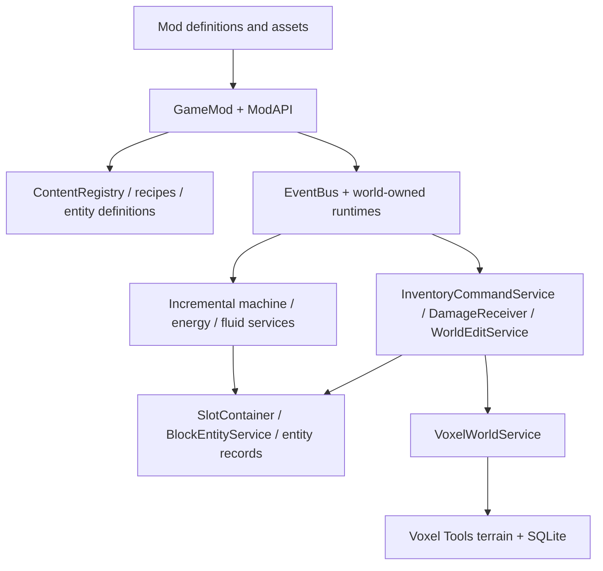
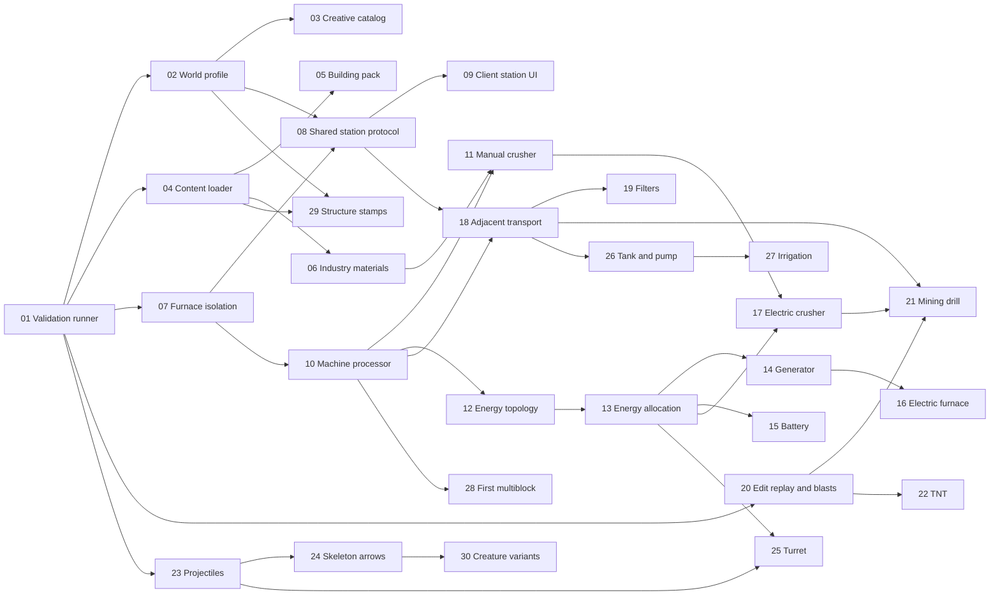

# GO.VW development architecture and execution plan

Inspection date: 2026-10-08. Status: planning complete; none of the new implementation tickets has been executed by this document.

Project root: `C:/Users/Admin/Downloads/powered-by-go-vw-modular-steve-tools/powered-by-go-vw-modular`.
All code paths below are relative to this root. **Existing** means inspected or located in the workspace. **Proposed** means a future addition, not an available API. Executable tickets and the first ten prompts are in [LUNA_TASKS.md](LUNA_TASKS.md).

## 1. Technical direction

Preserve the existing voxel game and extend its services and mods. The next playable target is a small factory: mine ore, crush it, generate power, smelt it, move products into a chest, and power a defensive turret. Creative access makes every new component immediately testable. This combines building, survival, combat and engineering without requiring a complete Minecraft replica first.

Do not rewrite the player, inventory, terrain backend or mod loader. Add a generic interface only when the next concrete feature needs it. New blocks and recipes should eventually be configuration work; new behavior should usually be a small mod using existing services. Keep the user's ten-slot hotbar, repeated mining swings, expandable crafting benches, translucent foliage and existing material tiers.

## 2. Inspection and confidence

### Environment

| Component | Verified finding | Decision |
| --- | --- | --- |
| Godot executable | `4.7.1.stable.mono.official.a13da4feb`, obtained from the installed console executable | Use this installation for validation; do not upgrade the engine as part of content work |
| Project configuration | Godot 4.7 features, GL Compatibility renderer, `scenes/menu/MainMenu.tscn` entry point | Retain renderer and startup flow |
| Voxel Tools | GDExtension at `addons/GodotVoxelExtension/addons/zylann.voxel/voxel.gdextension`; minimum compatible Godot is 4.4.1 | 4.4.1 is **not** the Voxel Tools version |
| Exact Voxel Tools release | Not recoverable from the inspected manifest, bundled metadata or DLL file/product version fields | Release/commit remains unverified; do not invent a release number |
| Installed native fingerprint | Editor DLL SHA-256 `B24CC4EB8D22C27CE5BABF1CF23190571D4ACCA9B2D215CF9C9ADF00614BFC97` | Pin this working binary; obtain its original download/build provenance before an upgrade |
| Godot MCP Toolkit | Plugin 1.0.2; connection and inspection calls responded | Use its actual discovered schemas, not assumed capabilities from another MCP server |
| Autoloads | `GameAPI`, `NetworkManager`, `MCPRuntimeServer` | New feature runtimes belong under the active world, not new autoloads |

The working directory contains substantial existing modified and untracked gameplay files. They are the baseline, not disposable changes. Native temporary/backup DLL files are also present; leave them alone while the editor may hold the extension open.

The inspection sampled the composition root, APIs, registries, save services, world scene, inventory command path, crafting runtime, creature runtime, explosion implementation, mod manifests and existing test fixtures. It did not exhaustively read the asset collection or every script. The previous runtime audit recorded 15 mods, 107 blocks, 220 items and 117 recipes; those are historical counts, not a fresh runtime measurement in this planning pass. Findings below distinguish implemented paths from complete gameplay parity. This pass did not rerun the gameplay suite.

### Structure and systems to preserve

| Existing location | Responsibility and usable foundation |
| --- | --- |
| `core/api/GameAPI.gd`, `ModAPI.gd` | Composition root; per-mod API context; additive generic service extension points |
| `core/content/ContentRegistry.gd` | Namespaced content, automatic placeable items, tags, mining profiles, persistent numeric voxel mapping, snapshots and content signatures |
| `core/modding/ModLoader.gd`, `GameMod.gd`, `ModStorage.gd` | Dependency-resolved `res://mods`, `user://mods`, mounted packs and mod-local assets/storage |
| `core/events/GameEvents.gd`, `EventBus.gd` | Lifecycle, cancellable before-events, after-events and gameplay hooks |
| `core/world/VoxelWorldService.gd`, `WorldEditService.gd` | Loaded-cell access and validated terrain edits; public boundary around Voxel Tools |
| `core/world/WorldGenerationPipeline.gd`, `WorldGenContext.gd`, `terrain/world_generator.gd` | Ordered deterministic worker-safe generation using immutable snapshots |
| `core/world/WorldSaveService.gd`, `scenes/world/World.gd` | World catalog, seed metadata, SQLite terrain, active world scope and compatibility warnings |
| `core/inventory/SlotContainer.gd`, `Inventory.gd`, `InventoryCommandService.gd` | Stack operations, filters, revisions, cursor, equipment, ten-slot hotbar, validated commands |
| `core/world/BlockEntityService.gd` | Sparse station records, named containers, state, player data and persistence |
| `core/inventory/CraftingService.gd`, `mods/shaped_crafting/GridCrafting.gd` | Ingredient tags, station capabilities, shaped recipes and connected workbench grids |
| `core/inventory/ItemInstanceService.gd`, `mods/equipment_condition` | Unique tools, condition, repair and modifier statistics |
| `core/combat/DamageReceiver.gd`, `mods/player_survival`, `mods/entity_framework/NetworkVitals.gd` | Damage, armor, melee and local/host vitals paths |
| `mods/entity_framework/EntityActor.gd`, `EntityRuntime.gd`, `GridPath.gd` | Persisted creatures, bounded path search, roaming/chasing/fleeing, ability components, loot and host replication |
| `mods/first_creatures`, `mods/basic_survival` | Cuboid visuals and skins; animals, enemies, crops, resources, bow and creeper explosion |
| `mods/player_skins`, `core/player/PlayerVisual.gd` | Player skin selection, held items, poses and multiplayer presentation |
| `mods/block_feedback`, `mods/player_actions`, `core/player/VoxelInteractor.gd` | Repeated mining, tool priorities, crack stages, placement delay, swing and sounds |
| `mods/transparent_blocks`, `mods/tree_props`, `mods/frontier_survival` | Transparent model handling, textured foliage/glass, voxel trees, ores, caves and biome variants |
| `mods/debug_console/Console.gd` | Existing content discovery, give, summon and testing commands |
| `tests/*.tscn`, `tests/*.gd` | Existing executable smoke scenes and multiplayer/visual fixtures |

### Implemented, incomplete and absent

**Already implemented:** player movement and placement/mining; drag/split/group inventory; equipment and dropped-item interactions; world creation/deletion without an automatic default world; persistent chests and fuel furnaces locally/on host; tag-aware shaped crafting with larger connected benches; tool wear and repair; local hunger/fall/drowning/death; hostile/passive creatures with basic navigation; saved mobs; basic crops; ores/caves/trees; transparent blocks; creeper terrain destruction, damage, knockback, sound and particles; skins and multiplayer poses.

**Partial:** remote station access is blocked despite host-owned inventory support; client survival differs from the local survival controller; bow hits are instantaneous rather than traveling projectiles; the console's time command is a lighting preset, not a day cycle; crops use simple elapsed growth without irrigation; full creature-record snapshots are not an interest-managed protocol; natural creature records can fill their cap; world content compatibility warns but does not establish a portable, world-owned voxel ID map. The first-creatures mod disables natural skeletons, but basic-survival later sets them true; T24 explicitly restores the user's requested false value. These are limitations, not reasons to rebuild working systems.

**Absent in inspected architecture:** general machine definitions/processing, electricity, fluid tanks/pipes, automated transport/mining, reusable multiblock validation, generic projectile runtime, factions/professions, dimension switching, vehicles/moving voxel assemblies, programmable machinery, and a searchable creative catalog. No public `api.machines`, `api.energy`, `api.fluids`, `api.explosions`, `api.projectiles` or `api.profile` currently exists.

### Weaknesses that matter now

1. `StationRuntime._process()` chooses a furnace by the presence of an `input` container. A future crusher with input/fuel/output could accidentally smelt. T07 restricts both the loop and direct tick to the furnace block kind.
2. The network inventory adapter has a fixed operation whitelist. Station requests and creative grants need deliberately specified server paths, not direct client mutation.
3. Terrain-change persistence/late-join replay is embedded in `SurvivalRuntime`; creeper explosions depend on this crop runtime. T20 separates only that contract before TNT and mining automation use it.
4. Terrain, station containers, inventories and entity ledgers save separately. Command rollback helps ordinary failures, but does not promise cross-file crash atomicity. T08 puts remote station transfers into a recoverable journal; existing unrelated drop behavior stays intact.
5. Numeric voxel IDs live in `user://content/voxel_ids.json`, outside individual worlds. Never reorder/delete this mapping. Before world sharing or selectable content packs, snapshot the map per world and design import compatibility with Sol. Unknown IDs currently become empty native models, so unloading content can make saved blocks appear absent.
6. Mods build materials/models and register many definitions through custom GDScript. T04 adds an optional, validated data loader; no bulk migration of old mods is needed.
7. There is no runtime feature flag contract. T02 adds flags while still registering definitions so switching behavior off cannot renumber or hide saved content.
8. Assertions/parser errors in scene tests are not necessarily reliable process exit failures. T01 adds bounded execution and diagnostic scanning, avoiding misleading green results and endless retries.

## 3. Architecture: small shared contracts, concrete mods



Use composition and dictionaries. Registries hold definitions; world-owned runtimes hold active simulation; services validate mutations; UI submits operations and displays snapshots. Keep `GameMod` as the mod entry point, not a deep class hierarchy. Add no ECS, global dependency injection framework, universal simulation language or native rewrite.

### Data and ownership contracts

- **Definition:** namespaced ID, display name, tags, icon/model, ordinary properties. Definitions register at startup before `content.finalize()`. A content loader validates a pack before submitting its definitions.
- **Instance:** stable instance ID only for unique equipment/entities; ordinary stack records use existing `id`, `count` and metadata. Never treat differently conditioned tools as identical stacks.
- **Position record:** existing station key identifies a voxel cell; record contains logical block ID, containers and runtime state. Ordinary terrain cells have no scene node. A machine node is optional for presentation, not inventory storage.
- **Command:** trusted actor plus operation, slot/cell indices and revisions. The server resolves the sender and item definitions. Clients never submit replacement inventory records, arbitrary output amounts or authority claims.
- **Mutation:** loaded-cell check, operation, existing before/after hooks, replication/history, sidecar dirty mark. Automation checks output capacity before consuming resources or destroying terrain.
- **Save:** retain SQLite terrain and existing sidecar names. Add fields with defaults, preserve unknown data, version genuinely new schemas, write temporary files then replace. Failed writes stop the affected mutating feature and report one clear error. Do not regenerate malformed worlds.

### Fifteen subsystem decisions

| Subsystem | First implementation and reuse | Later expansion boundary |
| --- | --- | --- |
| Blocks/materials | Existing registry/tags/models; optional JSON cube descriptor through voxel adapter (T04–T05) | Shapes/rotation metadata when a real door, slab or oriented machine needs them |
| Items/inventories | Existing `SlotContainer`, commands and item instances; creative catalog (T03) | Ammo magazines, attachments and specialized equipment via metadata/filters |
| Recipes | Existing shaped crafting remains; processing uses explicit method, duration and concrete inputs (T10) | Tag inputs/multiple outputs after first processor; no universal recipe interpreter |
| Tools/weapons | Existing mining/condition/damage; shared traveling projectile (T23) | New tool/weapon definitions and small ability modules |
| Machines/multiblocks | Data-only machine registry plus one fixed-step runtime using station records (T10); explicit small assembly validator (T28) | Additional machines primarily definitions, assemblies explicit patterns |
| Electricity/storage | Six-face voxel connectivity, dirty-region graph and fixed-step allocation (T12–T15); integer abstract energy | Switches/priorities/overload only after generator–battery–consumer loop works |
| Fluids/gases | Sparse tanks with fluid ID and integer amount; one bounded pump (T26) | Pipe graphs, mixing and gas hazards; continuous terrain fluid simulation is a separate profiled project |
| Explosions | Reuse current damage/LOS/impulse/particles; generic edit replay then source-independent blast (T20) | Blast resistance, selective drops and chain reactions as capped parameters |
| Automation/logistics | Fixed-step adjacent transfer of real stacks (T18–T19), output-safe drill (T21) | Visible conveyors built over transport state; networks only after adjacency is fun |
| Creatures/NPCs | Existing registry, actor, bounded grid path and ability composition (T24/T30) | Simple faction IDs/relations and profession behaviors; no full settlement simulation first |
| Biomes/structures | Existing deterministic stage pipeline; pure sparse blueprint stamps (T29) | Weighted prefab tables and region caches; respect chunk boundaries and old save seeds |
| Dimensions/planets | Future world catalog entry per dimension with independent terrain stream/seed and explicit links | Portal save/load first; planets are collections of scenes/biomes before spherical terrain |
| Vehicles/moving structures | Future sparse `RigidBody3D` vehicle with seat/cargo and fixed model | Detached voxel assembly only after authoritative extraction/placement/ownership is designed by Sol |
| Factions/professions | Future `faction_id`, relation table and small trade/guard/miner abilities using inventory/damage | Settlement budgets and jobs added incrementally; avoid world-wide ticking NPC economies |
| Mods/flags | Existing loader, namespaces and relative assets; runtime flags and validated packs (T02/T04) | Pack selection and portable world maps require compatibility design; mod code is trusted executable code |

### Minimum new infrastructure

Build only T01–T04, the station guard T07, and machine registration/processing T10 before the first crusher. Remote station transport T08–T09 is needed for shared machines, but local content tasks can proceed independently. Energy graphs, projectiles and fluids are deferred until their first producer/consumer feature. No upfront implementation of the fifteen subsystems.

Public proposed APIs are established by specific tickets. They are **not available today**:

| Ticket | Proposed contract |
| --- | --- |
| T02 | `api.profile.mode()`, `enabled(flag)`, `snapshot()`, `activate(config)`, `clear()`; world-scoped, host-owned |
| T04 | `api.register_content_pack(relative_path) -> Dictionary`; strict schema v1; cube construction delegated to `api.world` adapter |
| T08–T09 | `api.stations.view(id) -> Dictionary`, `api.stations.request_open(actor,id)` / `request_close(actor,id)`; reliable station snapshots + existing `station_transfer` command |
| T10 | `api.machines.register(definition) -> bool`, `definition(block_id)`, `ids()`; proposed registry is data, runtime is a mod |
| T12–T13 | `api.energy.register(definition)`, `stored(cell)`, `deposit(cell,amount)`, `consume(cell,amount)`; authority-only mutation, state stored with stations |
| T20 | `api.terrain_changes.change(cell,id)`, `flush()` and `api.explosions.blast(source_id,center,options)`; bounded/replayed edits |
| T23 | `api.projectiles.spawn(definition_id,origin,direction,source_id)`; authority simulates, clients render |
| T26 | `api.fluids.amount(cell)`, `transfer(source,destination,amount)`; integer units, validated compatible type/capacity |

Wire an additive public service in `GameAPI`, `ModAPI` and each context created by `ModLoader` only in its owning ticket. Preserve API version 1 for compatible additions. Do not expose raw native voxel objects to feature mods. Make any extra native cube-building code part of `VoxelWorldService` to respect the current contributor contract.

### Simulation and performance

Begin machines/logistics/energy at 5 Hz, not one `_process()` per block. Iterate only sparse, loaded records; keep inventories/state saved for unloaded records but pause their simulation. Build graphs on edits, never flood-fill the entire terrain each tick. Limit initial graphs to 512 visited cells per rebuild and pending jobs to bounded slices; a limit yields a visible stalled status, not a crash or silent deletion. Initial drill: one cell per second. Blast: radius at most 4 and a fixed edit budget. Projectile: cap 128 active, lifetime at most 10 seconds. These are initial tunable budgets, not measurements of actual hardware performance.

Worldgen callbacks remain pure: `WorldGenContext`, noise, immutable snapshot and local computation only. Ordinary blocks remain voxel data. Keep collision/visual proxies sparse. Record timings/counts only for a demonstrated bottleneck; reach for C++/GDExtension after profiling shows GDScript scheduling or an unavailable native operation is limiting play.

### Persistence and experimentation

New metadata fields: `profile_version`, `game_mode`, `feature_flags`, with survival/default-off values for older saves. Flags enable simulation or interaction, not removal of definitions. Disabled machines preserve contents/state and show "Disabled in this world". Initial toggles apply on world launch; do not implement hot reload.

New worlds retain existing content/mod compatibility signatures. Before portable saves or content-pack unloading, Sol must design a world-owned numeric-map snapshot and refuse ambiguous imports instead of guessing. Keep current IDs and aliases forever once saves can contain them. If a renamed item is required, register a compatibility alias/migration explicitly.

Station transfers touch player and station saves: T08 uses a bounded pending/committed transaction journal and recovery before commands are accepted. Machine completion changes two containers within the same station save; stage/rollback that record on failure. Terrain plus item extraction is not fully crash-atomic today: the first drill is marked experimental, pauses on save failure, and must not advertise exactly-once durability until a shared edit journal is designed. This limit does not justify rewriting every existing system before building a factory.

Malformed optional data can reject that pack with a precise error. Runtime flags reduce feature coupling; they cannot guarantee isolation from a GDScript parse error in eagerly loaded code. Keep experimental mod entry scripts valid and give optional assets fallbacks.

## 4. Reusable frameworks with the largest return

| Rank | Framework | Immediate payoff | Subsequent inexpensive content |
| --- | --- | --- | --- |
| 1 | Existing containers + station command/view protocol | Shared chests/furnaces and machine inventories | Supply stations, shops, weapon benches, loot containers |
| 2 | Optional validated content packs | Eight blocks and industrial resources with almost no custom code | Hundreds of textures, ores, foods, recipes and tool variants |
| 3 | Generic machine processor | Manual crusher first | Electric furnaces/crushers, sawmills, presses, chemical processors |
| 4 | Energy ports + allocation | Generator, battery and consumers | Lamps, pumps, drills, turrets, chargers |
| 5 | Existing entity abilities + shared projectiles | Skeleton arrows and turret combat | Shooter weapons, traps, enemy variants, RPG attacks |
| 6 | Shared edit replay + explosion | TNT, drill and creeper reuse | Demolition charges, rockets, area tools and world hazards |
| 7 | Bounded adjacent logistics | Chest-to-machine factory | Filters, inserters, harvesters and later visible belts |
| 8 | Sparse fluids + structures | Tank, pump, irrigation, ruins | Refinery recipes, hazards, settlements and dimension content |

The productivity improvement comes from explicit contracts and reused state, not simply moving code into more files.

## 5. Dependency graph and playable milestones



The graph shows the major dependencies. The task index in `LUNA_TASKS.md` includes all prerequisites and is ordered for sequential execution; independent content branches can proceed once their prerequisites pass.

## 6. Roadmap by gameplay value

| Phase | Exit experience | Scope and priority | Model emphasis |
| --- | --- | --- | --- |
| 1: accessible foundation | Create a world, access any registered item, build/mine, save/reload without losing controls | T01–T04/T07; preserve current foundation; fix only observed failures | Light checks, Medium profile/catalog/loader |
| 2: cheap content and shared stations | New building materials, industrial inputs, persistent shared stations and a working manual crusher | T05–T11; existing survival/creatures stay playable | Light definitions, Sol station recovery, Medium integration |
| 3: first factory | Fuel generator → cable → battery → electric furnace/crusher; chest → transfer → output; drill mines ore | T12–T21; adjacent transport before attractive belts | Sol allocator once; Light machine configurations; Medium topology/logistics |
| 4: interacting sandbox | TNT modifies terrain; skeleton shoots; powered turret defends; pump irrigates; assembly and ruins reward building/exploration | T22–T30 | Light content/abilities, Medium shared runtimes |
| 5: larger modules | One cargo vehicle, one portal destination, one NPC trader/guard, then a planet/settlement experiment | After 30; separate short tickets using proven containers, damage, records and generation | Sol moving terrain/world identity design; Medium interactions; Light content |

These phases are playable slices, not a demand to finish every checkbox before crossing a boundary. For a solo session, content and the manual crusher can ship while remote station work waits. For multiplayer releases, T08–T09 are a gate for shared machine interaction.

After T30, use three demonstrations before broad expansion: (1) a fixed-model cargo cart with a seat and saved inventory; (2) a portal between two ordinary voxel worlds, saving inventory/world identity before travel; (3) a trader with a faction ID and a small exchange table. Avoid spherical planets, dynamic detached terrain, universal pipe chemistry, complex professions and programmable circuits until these smaller loops are fun. Existing Minecraft gaps such as day/night, beds, doors/slabs, breeding and better crop rules remain optional content branches in `docs/MINECRAFT_FEATURE_ROADMAP.md`.

## 7. Model allocation

"Luna Light" means the user's Luna workflow with a low reasoning setting, not a separate verified model product. "Luna Medium" means medium reasoning. Sol owns interfaces, difficult save/network boundaries and diagnosing failures across systems. Official documentation describes Luna as suited to focused high-volume work and recommends testing the lightest setting that meets the quality bar. The allocations below are project-specific judgments, not guaranteed quota savings. [Luna model](https://developers.openai.com/api/docs/models/gpt-6-luna), [model selection](https://developers.openai.com/api/docs/guides/model-selection).

| Work | Default | Why |
| --- | --- | --- |
| Definitions, textures, recipes, numeric balance, configured machine variants, simple ability configuration | Luna Light | Fixed schema, named IDs, narrow diff and observable result |
| Validation runner, manifest checks, bounded one-condition repairs | Luna Light | Predictable work with explicit expected diagnostics |
| UI adapters, optional loader, machine runtime, energy connectivity, transport, projectile integration, structure generation | Luna Medium | Multiple existing contracts/state transitions; moderate integration work |
| Recovery journal and shared inventory transactions; energy allocation invariant; world-map portability; moving structures | Sol | Mistakes can corrupt or duplicate state across files/peers; design once, reuse repeatedly |
| Unexplained native crashes or persistent cross-system failures | Sol; stronger only with demonstrated need | Diagnose the causal boundary before repeated edits |

Do not give Light a vague framework task. T05/T06/T11/T14–T17/T19/T22/T24/T27/T30 are the main low-effort content stream, unlocked by small Medium/Sol implementations. The first turret (T25) uses Medium because it combines targeting, ammunition, energy and projectiles; later variants can use Light. Let an implementation task report a missing prerequisite rather than invent a replacement framework. If an architectural dependency changed, Sol updates its contract once and regenerates only affected tickets.

## 8. Validation and Godot MCP workflow

### Default loop

1. Read `AGENTS.md`, this plan's relevant contract, the selected ticket and only its listed source windows. Inspect the working diff before editing.
2. Edit files directly. Batch independent reads/checks in one tool orchestration call. No repeated editor launch for JSON or ordinary GDScript edits.
3. Static checks: changed JSON manifests, declared dependencies, referenced assets/scenes, logical IDs, native binary presence; search touched feature files for `Global.` and hard-coded numeric voxel IDs.
4. Parse changed GDScript with the connected MCP `script_check({file_path: "res://..."})`; this is diagnostic evidence, not proof of gameplay.
5. Run the smallest relevant runtime scene through T01 with a timeout. Scan both streams for `SCRIPT ERROR`, parser/compile errors, assertion failures and failed load diagnostics as well as exit status and required PASS marker.
6. UI/visual change: one targeted MCP playtest/screenshot. Persistence change: mutate, save, quit, reopen isolated fixture and compare logical state. Shared state: local ENet host/client fixture including a late join or contention case.
7. Report changed files, gameplay effect, exact validation performed and remaining limitation. Record status on that ticket. Do not rerun unrelated suites without a new reason.

Known executable:

```powershell
$godotForGoVW = 'C:\Users\Admin\Downloads\Godot_v4.7.1-stable_mono_win64\Godot_v4.7.1-stable_mono_win64\Godot_v4.7.1-stable_mono_win64_console.exe'
& $godotForGoVW --headless --path . res://tests/InventoryFoundationSmoke.tscn
```

T01 introduces the wrapper command; it does not exist yet. Do not use `--editor` just to run a smoke scene. The current editor can keep the native DLL loaded and interfere with import-time file replacement.

### Existing regression anchors

| Change type | Reuse these scenes as relevant |
| --- | --- |
| Inventory/data | `InventoryFoundationSmoke`, `InventoryUISmoke`, `EquipmentConditionSmoke` |
| Save/catalog | `WorldSaveCatalogSmoke`, `WorldDeleteMenuFixture` |
| Crafting/stations | `CraftingStationsSmoke`, `HostFurnaceSmoke`, `ShapedCraftingSmoke` |
| Terrain/content | `MiningSmoke`, `TransparentBlocksSmoke`, `ProgressionWorldSmoke` |
| Creatures/combat | `CreatureSmoke`, `CreatureNetworkSmoke`, `CreeperSmoke`, `CreeperNetworkSmoke`, `SurvivalCombatSmoke` |
| Shared survival | `BasicSurvivalSmoke`, `BasicSurvivalNetworkSmoke` |
| Presentation | `PlayerSkinSmoke`, `MultiplayerPresentation`, `HeldItemPreview`, `MobExplosionPreview` |

Names in this table are `res://tests/<name>.tscn`. Test fixtures use dedicated test save roots, not the user's actual worlds. Use existing plain GDScript scenes; no new testing dependency. Tests should exercise conservation, authority, loaded-cell bounds, saved state and controls. Avoid tests that merely repeat every data row or prove a one-line visual constant.

### Verified MCP use

Available default tools include `script_read` with line windows, `script_check`, `project_get_settings`, `autoload_manage`, scene inspection, runtime start/stop, input simulation, screenshots and debugger/console retrieval. `discover_tools` lists optional groups with schemas; activate only a necessary group, usually runtime inspection or editor refresh. In this session asset/class-database groups were discoverable, but do not rely on a lazily advertised tool being callable without verifying activation. `execute_code` is restricted node-scoped expression evaluation, not unrestricted filesystem or singleton scripting.

Use MCP for scene/resource operations and visual behavior that require the editor. Use shell/file tools for source edits, directory searches and headless tests. Never plan a tool loop that requires an unverified operation. If a tool fails, use the already verified CLI/file path and record the tooling limitation rather than redesign gameplay around it.

## 9. Assets and suitable upstream reuse

Existing catalog: `docs/ASSET_TEXTURE_CATALOG.md`. Verified texture root: `assets/minecraft-inspired-textures-free/{block,item,entity}`. It includes furnace faces, iron/copper blocks and ingots, TNT faces, glass, stone bricks and creature skins. Existing mods already have industrial ore/tool/icon resources; reuse their registered IDs instead of adding parallel iron/copper systems. Cubes, colored wire/tank indicators and existing procedural particles are sufficient for the first factory; new polished models are not prerequisites.

The Minecraft texture folder's README identifies Minecraft textures version 1.19 and does not establish a redistribution license. Treat supplied files as local prototype inputs pending asset provenance review; keep public release assets replaceable through packs. Prefer the bundled Kenney packs for distributable placeholders where their included license permits. This affects release packaging, not the user's ability to prototype with supplied assets.

| Source | Suitable reuse | Boundary |
| --- | --- | --- |
| [Zylann voxelgame](https://github.com/Zylann/voxelgame) | Small voxel usage examples when the current adapter needs an operation | README targets Godot 4.4 and describes basic multiplayer; verify against the installed extension before adapting. Preserve [license notices](https://raw.githubusercontent.com/Zylann/voxelgame/master/LICENSE.md) |
| [Godot demo projects](https://github.com/godotengine/godot-demo-projects) | Isolated Godot input, physics, particles or UI examples | Select the matching engine branch/example and inspect that example's assets; retain [code license](https://raw.githubusercontent.com/godotengine/godot-demo-projects/master/LICENSE.md), do not merge a whole project |
| [Kenney Impact Sounds](https://kenney.nl/assets/impact-sounds) | Existing impact audio, licensed CC0 | Already supplied under `assets/kenney_impact-sounds`; no download needed for mining/machine feedback |

Import third-party code only when it replaces a specific task cheaply, its license/assets are suitable and an integration test exists. Luanti mods can inspire definitions/recipes but their Lua engine APIs do not run in Godot; a port is its own ticket, not a free plugin. Independently implement general game mechanics; do not copy proprietary game source. No external code or additional assets were downloaded or integrated during this planning pass.

## 10. Context and usage optimization

- Keep these two documents as the durable handoff. `LUNA_TASKS.md` contains ticket status, contracts and prompts; the implementation agent reads one ticket, not the entire conversation.
- Give Light an exact content table, asset paths, defaults, target files and named acceptance criteria. Once T04/T10 work, clone definitions rather than scripts. Batch 5–10 similar definitions under one coherent ticket.
- Read with `rg` and line windows. Skip `.godot`, native binaries and asset directories unless the ticket needs them. MCP discovery is once per session/domain, not once per file.
- One feature slice per diff. Do not combine an engine upgrade, save migration and unrelated content addition. Avoid reformatting existing code and bulk renames.
- On failure: preserve the error, smallest reproducer and diff. Allow one focused correction. If the same cause persists, promote Light → Medium; use Sol for authority/save/native boundaries. Do not spend repeated calls asking Light to rediscover architecture.
- Record actual outcomes: feature accepted, tool calls if available, elapsed time, failures and retry count. Compare successful features per usage consumed, not prompt size alone. Do not convert API prices into Plus five-hour capacity; product limits and effective consumption are not established by those prices.
- At a session boundary, update only ticket status, changed API and validation result. Keep prompts static unless interfaces changed. No long retrospective narrative or duplicate design document.
- Independent content tickets can run separately after their prerequisites; shared service files should have one active editor. This plan does not create new chats or launch implementation agents.

## 11. Immediate next action

Execute **T01: reliable headless smoke runner** with Luna Light. Existing smoke scenes already cover the important foundation, but there is no common runner that turns a hung/asserting/parser-failing scene into an unambiguous failure. This small task makes the next 29 tickets cheaper to verify. Then T02–T03 provide early creative access; T04 unlocks repeatable Light content work. See the complete prompt for T01 in `LUNA_TASKS.md`.

The task index is the execution source of truth. Preserve the architecture contracts and validation requirements when implementing each ticket.
